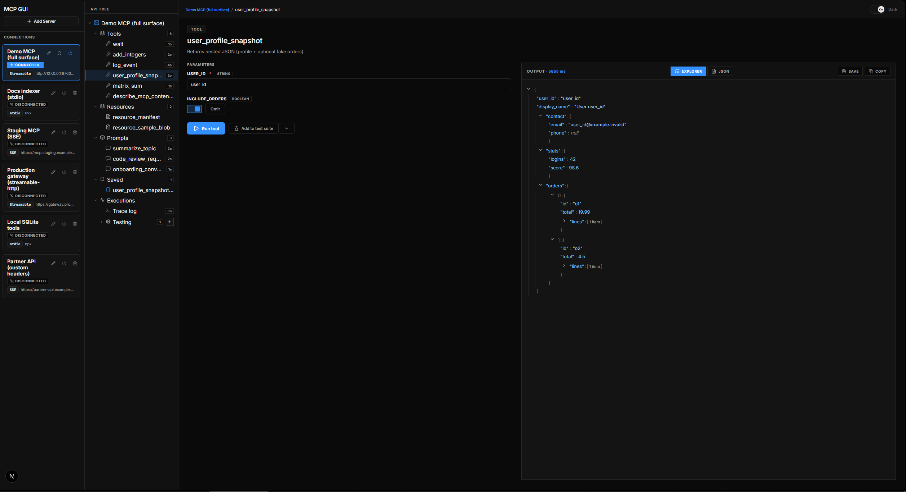
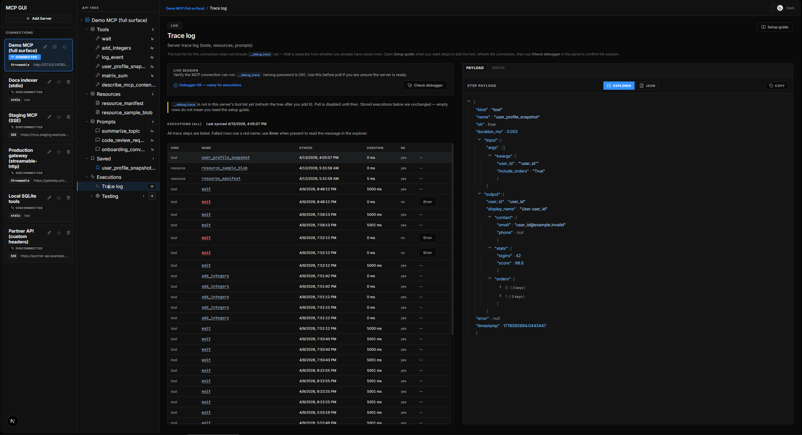

# MCP GUI

Web UI for browsing Model Context Protocol servers: tools, resources, and prompts. Remote connections support **Bearer profiles** (multiple saved tokens, one active), **custom HTTP headers**, **OAuth 2 client credentials** (manual token URL or MCP metadata flow via the SDK), and merging extra headers with any of the above. Built with [Next.js](https://nextjs.org/) and [`@modelcontextprotocol/sdk`](https://www.npmjs.com/package/@modelcontextprotocol/sdk).

## Screenshots

**Tool UI** — run an MCP tool with generated inputs and inspect structured results.



**Executions (trace log)** — history imported from the server’s `__debug_trace` tool (see [docs/debug-trace.md](docs/debug-trace.md)).



## Requirements

- Node.js 20+
- npm (lockfile included)

## Development

```bash
npm ci
npm run dev
```

Open [http://localhost:3001](http://localhost:3001). Connection **configs**, **trace secrets**, and **execution history** are stored in a local SQLite file at `data/mcp-gui.db` (created automatically; ignored by git). On first load after this change, any connections still in browser `localStorage` from an older build are **migrated once** into SQLite and the key is cleared.

### Desktop (Electron)

The Next.js server must still run (API routes and SQLite live on the server). Electron is a **root** devDependency (so `npm ci` / `npm install` at the repo root downloads the binary). `desktop:dev` waits on **TCP port 3001** (not HTTP) so tooling does not spam `HEAD /` and trigger Turbopack dev issues.

If **port 3001 is already listening**, `desktop:dev` inspects the owning process: when it looks like **Node/Bun** and the command line / paths include **this repository’s root**, only **Electron** is started (your existing `npm run dev` is left alone). If another program holds the port, the script exits with an error.

Override the port checked by the launcher with `MCP_GUI_PORT` (must match `next dev -p` in `package.json` if you change it).

```bash
npm ci   # or npm install
npm run desktop:dev
```

If Electron reports a failed install, remove `node_modules/electron` and run `npm install` again from the repo root.

If Next is already running on port 3001, you can open only the Electron window:

```bash
npm run desktop:start
```

Override the loaded URL (default `http://localhost:3001`, aligned with Next’s dev URL) with `MCP_GUI_URL`. For local HTTP (`localhost`, `127.0.0.1`, `::1`), Electron turns off `webSecurity` so Next/Turbopack **HMR WebSockets** (`/_next/webpack-hmr`) can complete the handshake. Set `MCP_GUI_SUPPRESS_ELECTRON_SECURITY_WARNINGS=false` if you want Electron’s CSP warnings in the console.

## Production

```bash
npm run build
npm run start
```

## Guides

- **[Debug trace tool (`__debug_trace`)](docs/debug-trace.md)** — configure MCP GUI and your server for the **Executions** tab and trace polling.

## Example MCP server (FastMCP)

A **demo server** under `scripts/fastmcp-example/` exposes many tools (nested JSON, enums, lists, optional fields), **resources** (static URI, template `demo://note/{name}`), **prompts**, and optional HTTP security.

```bash
cd scripts/fastmcp-example
python -m venv .venv
.venv\Scripts\activate   # Windows
# source .venv/bin/activate  # macOS / Linux
pip install -r requirements.txt
python server.py
# Require Bearer on /mcp:
python server.py --auth=true
```

- **URL:** `http://127.0.0.1:8765/mcp` (Streamable HTTP in MCP GUI).
- **With `--auth=true`,** use primary auth **Bearer** and one of: `demo-admin`, `demo-readonly`, `partner-service-key`, or the token from OAuth below. Add several tokens in the GUI as **Bearer profiles** and switch the active radio before **Connect** / **Save & reconnect**.
- **OAuth 2 client credentials (manual)** in MCP GUI: set primary auth to **OAuth 2 client credentials (token URL)**, token URL `http://127.0.0.1:8765/oauth/token`, client id `mcp-demo-client`, secret `mcp-demo-secret`. The issued access token is accepted as Bearer when `--auth=true`.
- **OAuth 2 MCP (metadata):** uses `@modelcontextprotocol/sdk` discovery; the demo exposes `/.well-known/oauth-protected-resource` as a minimal stub. Full interop may require a complete authorization-server metadata setup.
- **Custom / multiple headers:** use **Additional HTTP headers** in the connection form (e.g. `X-Request-Id` alongside Bearer).

Stdio: `MCP_HTTP=0 python server.py`, or `fastmcp run server.py` if the CLI is on your `PATH`.

### Server-side tracing (Executions tab + SQLite)

MCP GUI can **poll** a tool named `__debug_trace`, import the buffer into **SQLite** (`data/mcp-gui.db`), and show history on the **Executions** tab. Step-by-step setup (GUI password, `MCP_DEBUG_PASSWORD` on the server, implementing the tool and `@traced` decorator, polling, security) is in **[docs/debug-trace.md](docs/debug-trace.md)**. The FastMCP demo implements everything in `scripts/fastmcp-example/server.py`.

## License

MIT — see [LICENSE](LICENSE).
